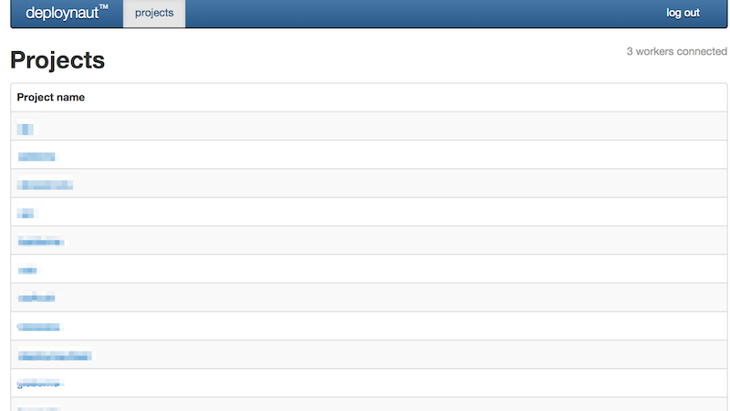
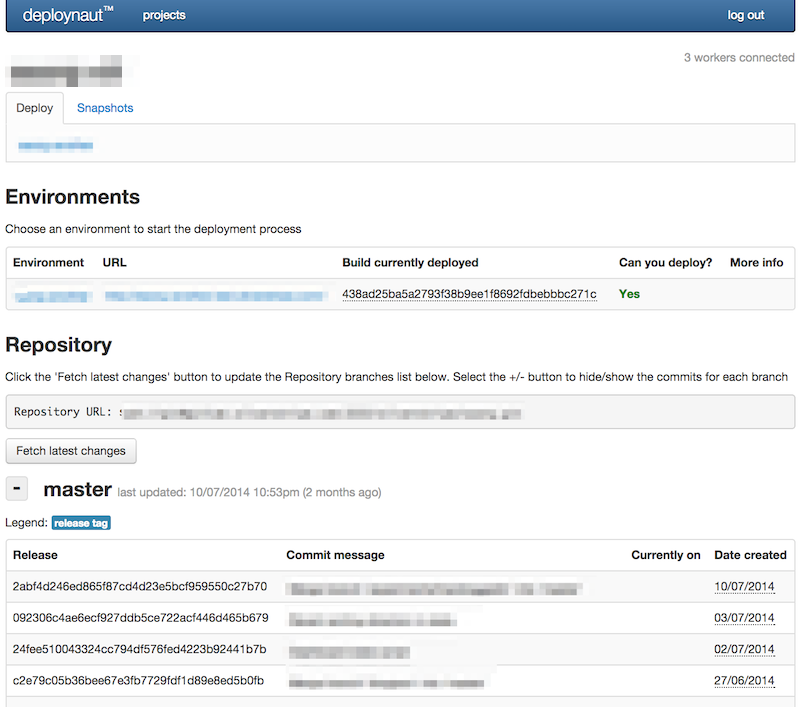
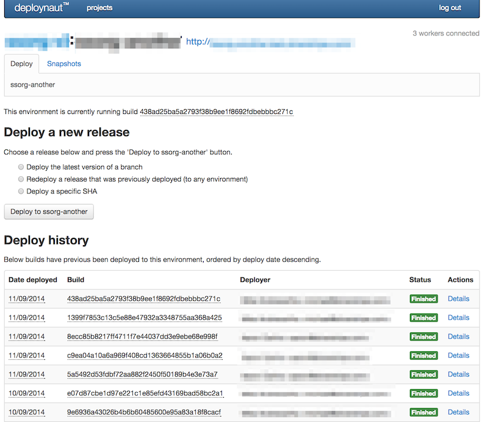
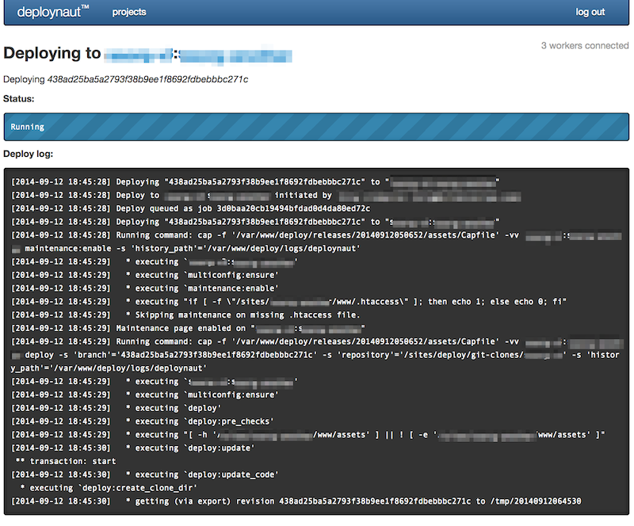

# Deploynaut

A web based front end for deployment of SilverStripe 3.* sites.

## Overview

Deploynaut is a blend of SilverStripe code that is calling [Capistrano 2](https://github.com/capistrano/capistrano/) recipies to manage deployment of other SilverStripe sites.

The main design considerations have been:

 - Easy and carefree deployments for non-technical (and technical) people
 - Easy configuration and setup of new environments via a web ui

## Screenshots

### Project list

### Project view

#### Environment view

#### Deployment view

