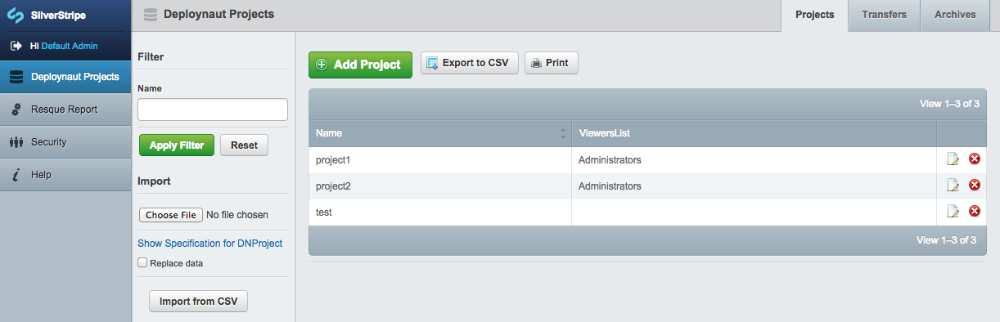
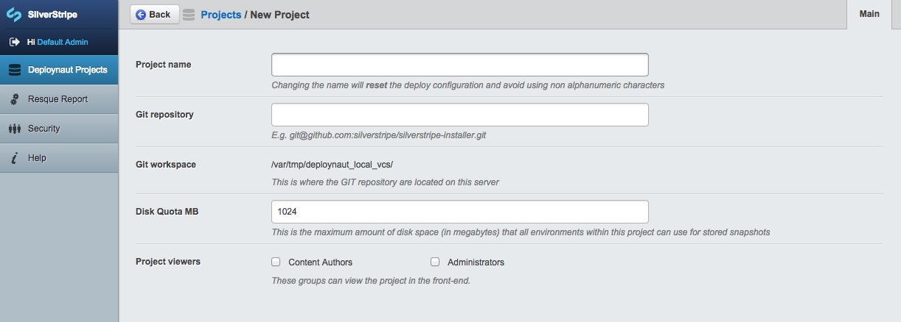
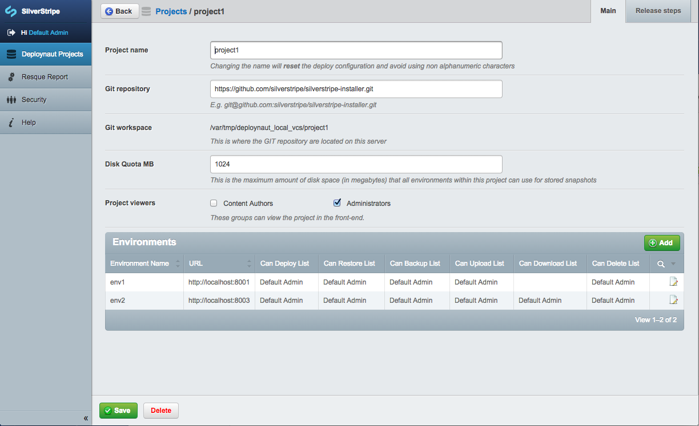
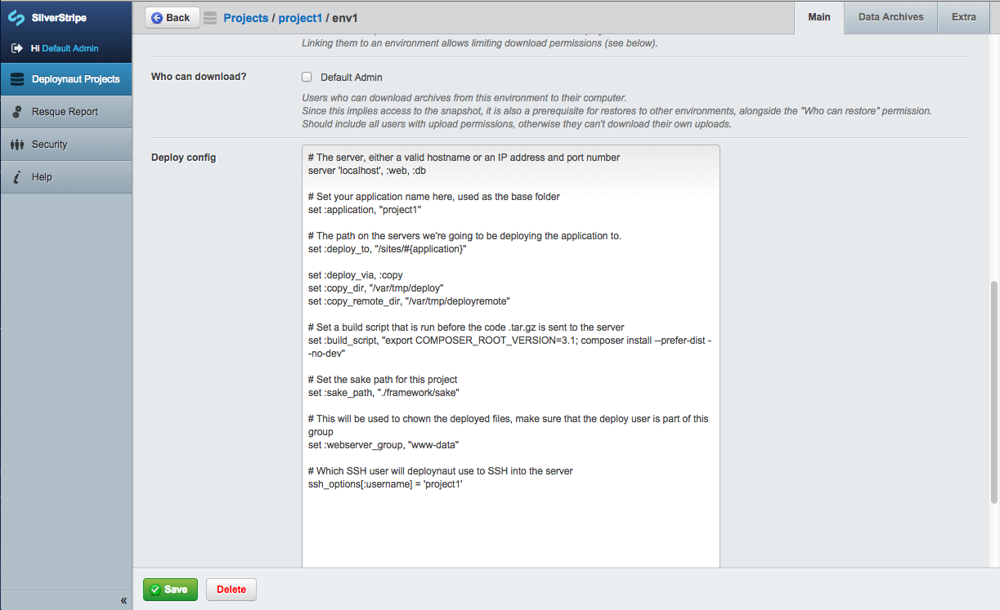

# Deploynaut

Deploynaut is a SilverStripe module providing a user interface on top of [Capistrano](https://github.com/capistrano/capistrano/) for managing deployments of SilverStripe sites. It uses an implementation of Redis based [php-resque](https://github.com/stojg/silverstripe-resque) for the background deploy tasks.

## System Requirements

Deploynaut has been tested on Debian Linux and OS X. It may work on other *nix OS, but no others have been tested so far.

Since Deploynaut is essentially a SilverStripe site, the usual [system requirements for SilverStripe](http://doc.silverstripe.org/framework/en/installation/server-requirements) must be met, in addition to the following additional software installed on the host running Deploynaut:

 * git
 * tar
 * ruby
 * composer
 * redis
 * capistrano 2.15.5 + capistrano-multiconfig 0.0.4 (newer versions have NOT been tested, and DO NOT work)
 * [sspak](https://github.com/silverstripe/sspak)

Each Deploynaut target, the site you're deploying to, must have the following tools installed on the server, and be
available in the `PATH` environment:

 * tar
 * gunzip
 * mysqldump

The user that Deploynaut runs under (typically `www-data`) will need to be able SSH into the target machine without
a password in order to deploy. It will also need to be able to `git clone` your code repository using the same key.

## Installation

### Capistrano

Capistrano is written in ruby, and often deployed as a ruby gem. So the first requirement is to install it system wide:

	sudo gem install capistrano --no-ri --no-rdoc --verbose -v 2.15.5

Our implementation relies on capistrano-multiconfig extension which provides us with the ability to have multiple
projects, each with multiple configurations (e.g. prod, uat):

	sudo gem install capistrano-multiconfig --no-ri --no-rdoc --verbose -v 0.0.4

## PHP Resque service

An init.d script is included that allows start and stop of the queue service, and for it to automatically start on boot.

	sudo cp /sites/deploynaut/www/deploynaut/.scripts/deploynaut-php-resque /etc/init.d/deploynaut-php-resque
	sudo chown root:root /etc/init.d/deploynaut-php-resque
	sudo update-rc.d deploynaut-php-resque defaults

Note that if you installed Deploynaut into a directory other than `/sites/deploynaut/www`, the above file will need
to be modified so that the `ROOT` variable points to the site.

If you're on a platform that doesn't use `init.d` scripts, you can adapt the provided script to your own launcher.
For example, on OS X you could create a `launchd` script.

### Deploynaut

The following commands will check out the standard SilverStripe installer into `/sites/deploynaut/www`, and install
the Deploynaut module into the codebase using composer. The cms module is removed, as it is not needed for Deploynaut.

	sudo mkdir -p /sites/deploynaut/www
	sudo mkdir -p /sites/deploynaut/deploynaut-resources/envs
	sudo chown -R www-data:www-data /sites/deploynaut
	cd /sites/deploynaut/www
	composer create-project silverstripe/installer . 3.1.x-dev
	composer remove silverstripe/cms
	composer require "silverstripe/deploynaut:*"

You will then need to setup your Apache virtual host with a document root to `/sites/deploynaut/www`.

In addition to the [standard environment management setup](http://doc.silverstripe.org/framework/en/topics/environment-management) containing database credentials etc, you'll need to add some Deploynaut-specific enviroment configuration to your `_ss_environment.php` file. Typically
that would go in `/sites/deploynaut/_ss_environment.php`:

	define('DEPLOYNAUT_LOG_PATH', '/sites/deploynaut/www/assets/_deploynaut_logs');
	
	// we are using /var/tmp instead of /tmp so that the files are persisted between reboots
	define('DEPLOYNAUT_LOCAL_VCS_PATH', '/var/tmp/deploynaut_local_vcs');
	
	// the SSH key of the www-data user, used for authenticating access to remote servers
	define('DEPLOYNAUT_SSH_KEY', '/var/www/.ssh/id_rsa');
	
	global $_FILE_TO_URL_MAPPING;
	$_FILE_TO_URL_MAPPING['/sites/deploynaut/www'] = 'http://[YOUR_DEPLOYNAUT_URL]'

Ensure that you enter the URL where deploynaut can be reached into `[YOUR_DEPLOYNAUT_URL]`.

## Creating a new Deploynaut target

By default, there won't be any remote servers to deploy to.

To add one, you can enter the configuration for the remote server using the Deploynaut admin interface. For example,
http://yourdeploynaut/admin.

Go to the Deploynaut Projects section of the admin to setup a new project.

"Add Project" lets you create a new project, a new screen appears asking for the project name, and location of the Git
repository. Note that if you enter the URL of a private repository, the `www-data` user must be able to git clone it without a
password. This is usually done by taking the `www-data` public key and setting it up as a deploy key in your Git repository.

From here, you can also assign groups who can view the project on the Deploynaut frontend, but not deploy to any servers.

Once you've added your project, you'll have the ability to add environments to that project after creating it.

Click the "Add" button in the "Environments" table to add a new environment.

Specify the "Environment name" which is the intended stage of the target server, for example, this could be "prod"
or "uat". Note that "test" will not work!

Server URL refers to the URL that the website running on the target can be reached at.

"Who can deploy?" is a list of the project viewer users assigned to the project, check who can deploy from this list.

After you've saved for the first save, a checkbox "Create config" will show up. Check this and save again to
create an initial Capistrano config for this environment. The file will be saved into `../deploynaut-resources/envs/{project}/{env}`
and you can edit it via "Deploy config" textarea field that shows up after the file has been generated.

Here's an example of what the configuration might look like:

	# The server, either a valid hostname or an IP address and port number
	server 'remotehost:2222', :web, :db
	
	# Set your application name here, used as the base folder
	set :application, "project1"
	
	# The path on the servers we're going to be deploying the application to.
	set :deploy_to, "/sites/#{application}"
	
	set :deploy_via, :copy
	set :copy_dir, "/var/tmp/deploy"
	set :copy_remote_dir, "/var/tmp/deployremote"
	
	# Set a build script that is run before the code .tar.gz is sent to the server
	set :build_script, "composer install --prefer-dist --no-dev"
	
	# Set the sake path for this project
	set :sake_path, "./framework/sake"
	
	# This will be used to chown the deployed files, make sure that the deploy user is part of this group
	set :webserver_group, "www-data"
	
	# Which SSH user will deploynaut use to SSH into the server
	ssh_options[:username] = 'project1'

Once you're done, hit "Save".

To test that Capistrano is able to remotely connect to the machine, click "Check Connection" button.

## Configuring snapshots

Create `assets/transfers` server-writable directory:

	mkdir assets/transfers
	chown www-data.www-data assets/transfers
	chmod 755 assets/transfers

Add `assets/.htaccess` to enable security checks on files:

	RewriteEngine On
	RewriteBase /
	RewriteCond %{REQUEST_URI} ^(.*)$
	RewriteRule .* framework/main.php?url=%1 [QSA]

See below in "Snapshot security" for essential information on securing files.

Add `assets/_combinedfiles/.htaccess` to allow direct serving of combined files:

	RewriteEngine Off

The [sspak](https://github.com/silverstripe/sspak) tool is required to create
archives of the database/assets for a specific environment into an `*.sspak` file.
This file can be used for backups, restores, and setting up local development environments.

	wget --no-check-certificate https://raw.github.com/silverstripe/sspak/gh-pages/sspak.phar; sudo cp sspak.phar /usr/local/bin/sspak

Set up feature flags in `_ss_environment.php`:

	// Enable for beta testers.
	//define('FLAG_SNAPSHOTS_ENABLED_FOR_MEMBERS', 'tester1@somewhere.com;tester2@somewhere.com');
	
	// Enable for everyone.
	define('FLAG_SNAPSHOTS_ENABLED', true);

## Pipelines

For full information, see the [pipelining documentation](pipelines.md).

Pipelines will be used to break down various processes within Deploynaut into individual steps, that are run one after
the other in a pipeline. This is modelled by the `Pipeline` and `PipelineStep` classes.

A Pipeline is associated with a DNEnvironment, and each environment can contain many pipelines, which contains the
history of various action within Deploynaut. Each Pipeline then has a set of ordered steps, which are defined
separately for each environment in a YAML file (see the [pipelines](pipelines.md) docs for details on that format),
and these are executed in order when a pipeline starts.

## Securing Snapshot Downloads

Deploynaut provides the ability to backup database and/or assets from a specific environment
and store them as an [sspak](https://github.com/silverstripe/sspak) snapshot on the Deploynaut filesystem.
These backups can be used to restore data onto an environment, or transfer it to a different environment.

All snapshots are stored within the deploynaut webroot under the `assets/` folder.
Downloads are secured through the [secureassets](https://github.com/silverstripe-labs/silverstripe-secureassets),
with permission checks enforced through Apache's `mod_rewrite` module.
Please create a file `assets/.htaccess` with the following content:

	RewriteEngine On
	RewriteBase /
	RewriteCond %{REQUEST_URI} ^(.*)$
	RewriteRule .* framework/main.php?url=%1 [QSA]

Permissions are granted in the CMS on a per-group basis, separately for the following actions:

 * *Download* an existing snapshot from Deploynaut to your local development environment
 * *Upload* an snapshot created from your local development environment into Deploynaut
 * *Backup* an environment into a new snapshot stored on Deploynaut
 * *Restore* an existing snapshot into an environment (overwriting existing data)

Since we can't rely on the webserver having enough space to create snapshots,
their data is downloaded into a temporary folder on the Deploynaut filesystem first.
Please ensure you have sufficient filesystem space available for creating snapshots
(at least twice the amount of uncompressed data on the environments).

Caution: Backups of databases on dedicated servers (separate from the webserver) are currently not supported.

## Troubleshooting

*Q: The deployment script log is not showing up, and the "Executing:" is not showing the command.*

The deployment relies on deploynaut.js file being available. For some reason it is not executing - check if the webserver can write to assets (it is trying to combine JS files into this directory).

*Q: The file upload fails with "no such file".

Make sure you are not using relative paths (e.g. ~)
